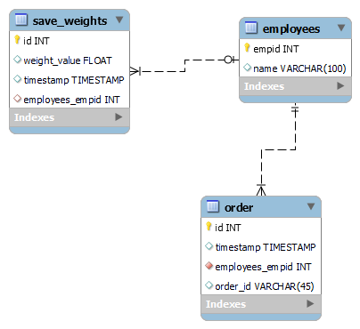

# Database Design 

## Database Design Description

The following section describes the **database design** for the **IoT Piano Visualizer**, which manages users, song data, and performance tracking. This database design ensures that each user's interaction with the system, including their selected songs and performance metrics, is accurately recorded and retrievable for analysis and improvement.

**ER Diagram**: 



### **1. Database Schema: `iot_piano_db`**
The schema `iot_piano_db` is created to manage all the database objects for the IoT Piano Visualizer. This schema contains three key tables: `users`, `songs`, and `performances`.

---

### **2. Table: `users`**

- **Purpose**: Stores information about users who are learning or interacting with the IoT Piano Visualizer.
- **Structure**:
  - `userid` (INT, AUTO_INCREMENT): The unique identifier for each user. This is the **Primary Key** of the table.
  - `username` (VARCHAR(100)): The name of the user.
  - `email` (VARCHAR(255)): The email address of the user for communication and identification.
  - `role` (ENUM('learner', 'admin')): Indicates the role of the user in the system.

- **Primary Key**:
  - `userid`: Ensures that each user has a unique identifier.

```sql
CREATE TABLE IF NOT EXISTS `iot_piano_db`.`users` (
  `userid` INT NOT NULL AUTO_INCREMENT,
  `username` VARCHAR(100) NOT NULL,
  `email` VARCHAR(255) NOT NULL,
  `role` ENUM('learner', 'admin') NOT NULL,
  PRIMARY KEY (`userid`)
) ENGINE = InnoDB;
```

---

### **3. Table: `songs`**

- **Purpose**: Stores the list of songs available for practice within the system.
- **Structure**:
  - `songid` (INT, AUTO_INCREMENT): A unique identifier for each song. This is the **Primary Key** of the table.
  - `title` (VARCHAR(255)): The name of the song.
  - `duration` (INT): The duration of the song in seconds.
  - `difficulty` (ENUM('easy', 'medium', 'hard')): The difficulty level of the song.

- **Primary Key**:
  - `songid`: Uniquely identifies each song.

```sql
CREATE TABLE IF NOT EXISTS `iot_piano_db`.`songs` (
  `songid` INT NOT NULL AUTO_INCREMENT,
  `title` VARCHAR(255) NOT NULL,
  `duration` INT NOT NULL,
  `difficulty` ENUM('easy', 'medium', 'hard') NOT NULL,
  PRIMARY KEY (`songid`)
) ENGINE = InnoDB;
```

---

### **4. Table: `performances`**

- **Purpose**: Tracks user performances, storing information about which song they played, the score achieved, and when the performance was recorded.
- **Structure**:
  - `performanceid` (INT, AUTO_INCREMENT): A unique identifier for each performance. This is the **Primary Key** of the table.
  - `score` (INT): The score achieved by the user during the performance.
  - `timestamp` (TIMESTAMP, DEFAULT CURRENT_TIMESTAMP): The time when the performance was recorded.
  - `users_userid` (INT): A foreign key linking to the `userid` field in the `users` table.
  - `songs_songid` (INT): A foreign key linking to the `songid` field in the `songs` table.

- **Primary Key**:
  - `performanceid`: Uniquely identifies each performance record.

- **Indexes and Foreign Keys**:
  - An **index** (`fk_performances_users_idx`) is created on the `users_userid` field to improve query performance.
  - A **foreign key constraint** (`fk_performances_users`) ensures that performance records are only associated with valid users.
  - Another **foreign key constraint** (`fk_performances_songs`) ensures that each performance is linked to a valid song.

```sql
CREATE TABLE IF NOT EXISTS `iot_piano_db`.`performances` (
  `performanceid` INT NOT NULL AUTO_INCREMENT,
  `score` INT NOT NULL,
  `timestamp` TIMESTAMP NULL DEFAULT current_timestamp(),
  `users_userid` INT NOT NULL,
  `songs_songid` INT NOT NULL,
  PRIMARY KEY (`performanceid`),
  INDEX `fk_performances_users_idx` (`users_userid` ASC) VISIBLE,
  INDEX `fk_performances_songs_idx` (`songs_songid` ASC) VISIBLE,
  CONSTRAINT `fk_performances_users`
    FOREIGN KEY (`users_userid`)
    REFERENCES `iot_piano_db`.`users` (`userid`)
    ON DELETE NO ACTION
    ON UPDATE NO ACTION,
  CONSTRAINT `fk_performances_songs`
    FOREIGN KEY (`songs_songid`)
    REFERENCES `iot_piano_db`.`songs` (`songid`)
    ON DELETE NO ACTION
    ON UPDATE NO ACTION
) ENGINE = InnoDB;
```

---

## **Summary of Database Design**

- **Schema**: `iot_piano_db`
  - Contains the tables `users`, `songs`, and `performances`.

- **Table Relationships**:
  - The `performances` table is related to both the `users` and `songs` tables via **foreign keys**. The `users_userid` field references `userid` in the `users` table, and the `songs_songid` field references `songid` in the `songs` table.

- **Referential Integrity**:
  - Referential integrity is maintained by foreign key constraints, ensuring that performance records are always linked to valid users and songs.

- **Indexing**:
  - Indexes are applied to the foreign key fields to enhance query performance when retrieving user performances or song data.
