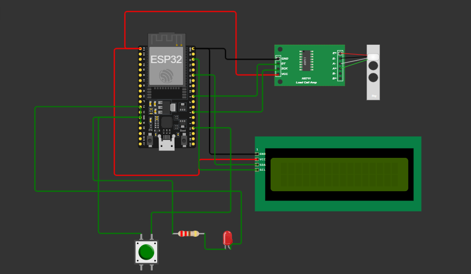

# Hardware Integration

The hardware integration of the **Tea Weight Scale System Prototype** involves the connection of several key components, including the **load cell**, **HX711 module**, **LCD display**, **push button**, and **LED**, all managed by a microcontroller (e.g., ESP32, Arduino). Here's a breakdown of how the hardware components are connected and interact.

## **Components Overview**:
- **Load Cell (20kg)**: Used to measure the weight of the tea.
- **HX711 Amplifier**: Converts the small signals from the load cell into measurable data.
- **LCD Display (16×4)**: Displays the measured weight and status messages.
- **Push Button**: Allows the supervisor to confirm the weight measurement.
- **LED**: Indicates the status of data transmission (e.g., lights up when weight is successfully sent to the server).
- **Microcontroller (e.g., ESP32 or Arduino)**: Controls the entire system, reads data from the load cell, and sends it to the server via Wi-Fi.

## **Hardware Integration Diagram**
Include a **circuit diagram** showing the wiring connections between the components. Here’s a general outline of the connections:

| Component     | Pin on ESP32/Arduino | Pin on Component         |
| ------------- | -------------------- | ------------------------ |
| HX711 DOUT    | GPIO 5               | DOUT on HX711            |
| HX711 SCK     | GPIO 4               | SCK on HX711             |
| LCD SDA       | GPIO 21              | SDA on LCD               |
| LCD SCL       | GPIO 22              | SCL on LCD               |
| Button        | GPIO 15              | One leg of the push button|
| Button        | Ground               | Other leg of the push button |
| LED           | GPIO 13              | Positive leg of the LED   |
| LED           | Ground               | Negative leg of the LED   |

The load cell connects to the HX711 module via four wires (Excitation+ (E+), Excitation- (E-), Signal+ (S+), Signal- (S-)). The HX711 module then connects to the ESP32 or Arduino for reading and processing the weight data.

#### **Working Flow**:
1. **Tea is Placed on the Scale**: The load cell captures the weight, and the HX711 module amplifies the signal.
2. **Weight Display**: The microcontroller reads the amplified signal from the HX711 and displays the weight on the LCD screen.
3. **Confirmation Button**: When the button is pressed, the microcontroller sends the measured weight to the server using Wi-Fi.
4. **Status LED**: The LED lights up when the weight is successfully transmitted, providing feedback to the user.

#### **Circuit Diagram Placeholder**:

#### **Power Supply**:
- The entire system can be powered via the microcontroller’s USB connection or an external battery, depending on the portability requirements.

