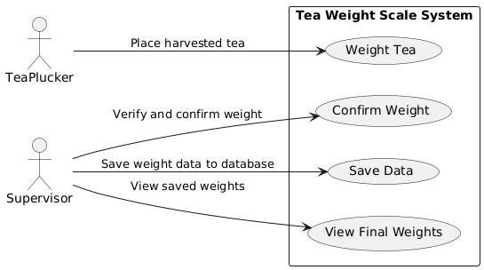
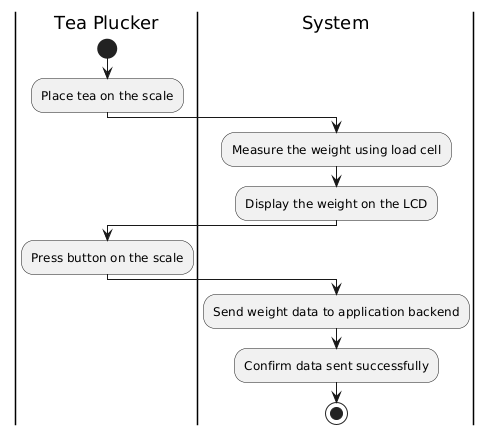
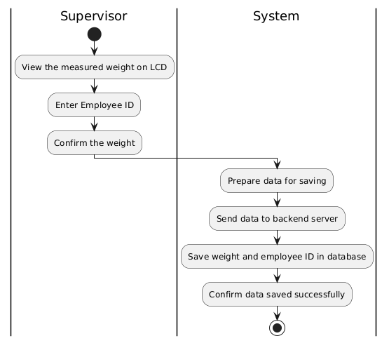
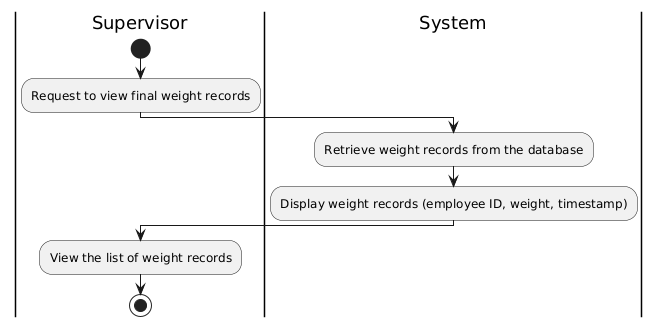

## Use Case Diagrams

The **Use Case Diagrams** illustrate how different actors (users) interact with the system. In the context of the **Tea Weight Scale System Prototype**, the primary actors are the **Tea Plucker** and **Supervisor**. The use case diagram helps outline the system's functionalities from the user's perspective.

#### **Primary Actors**:
1. **Tea Plucker**: Responsible for placing the harvested tea on the weight scale.
2. **Supervisor**: Verifies and confirms the tea weight and employee ID, and approves the data for storage.

---

### **Use Case Diagram 1: Tea Plucker and Supervisor Interaction**

#### **Use Cases**:
1. **Weigh Tea**:
   - **Actor**: Tea Plucker
   - **Description**: The tea plucker places harvested tea on the weight scale, and the system measures the tea's weight using the load cell.
   
2. **Confirm Weight**:
   - **Actor**: Supervisor
   - **Description**: The supervisor verifies the weight displayed on the LCD screen and confirms it by entering the employee ID and pressing the "Confirm" button.

3. **Save Data**:
   - **Actor**: Supervisor
   - **Description**: Once the weight and employee ID are confirmed, the system sends the data to the backend server, where it is stored in the database.

4. **View Final Weights**:
   - **Actor**: Supervisor
   - **Description**: The supervisor can view the final saved weights and related data (e.g., employee ID, timestamp) via the web interface.

#### **Diagram Description**:
- **Weigh Tea**: The system automatically measures the tea weight when the tea plucker places it on the scale.
- **Confirm Weight**: The supervisor verifies and confirms the data.
- **Save Data**: After confirmation, the data is saved to the database.
- **View Final Weights**: The supervisor views the saved data for reporting purposes.

**Use Case Diagram Placeholder**: 

## Activity Diagrams

Activity diagrams visually represent the workflows and processes within the **Tea Weight Scale System Prototype**. These diagrams detail the interactions between actors (tea pluckers, supervisors) and the system components, demonstrating how actions flow from one step to the next.

Below are the key activity diagrams relevant to the system:

---

### 1. **Weighing Tea and Sending Data Activity Diagram**

This diagram outlines the process in which the tea plucker places tea on the scale, the system measures the weight, and the tea plucker presses a button to confirm the weight, automatically sending the weight data to the application.

#### **Steps**:
1. Tea Plucker places harvested tea on the scale.
2. System measures the weight using the load cell.
3. System displays the weight on the LCD.
4. Tea Plucker presses the button on the scale to confirm the weight.
5. System sends the weight data to the backend application.

**Diagram Representation**:
- **Start**: Tea plucker places tea on the scale.
- **System Activity**: Measure the weight and display it on the LCD.
- **User Activity**: Press button to confirm the weight.
- **System Activity**: Automatically send weight data to the backend.
- **End**: The system waits for the next action.

**Activity Diagram Placeholder**: 

---

### 2. **Confirming and Saving Weight Activity Diagram**

This diagram illustrates the process the supervisor follows to confirm and save the tea weight in the system.

#### **Steps**:
1. Supervisor views the measured weight on the LCD.
2. Supervisor enters the employee ID.
3. Supervisor confirms the weight.
4. System saves the weight data to the database.
5. System sends confirmation of data save to the frontend.

**Diagram Representation**:
- **Start**: Supervisor views the weight.
- **System Activity**: Supervisor enters employee ID.
- **User Activity**: Confirm the weight.
- **System Activity**: Save the weight data in the database.
- **End**: The system notifies that the data is saved successfully.

**Activity Diagram Placeholder**: 

---

### 3. **Viewing Final Weight Records Activity Diagram**

This diagram demonstrates how the supervisor retrieves and views the final weight records stored in the system.

#### **Steps**:
1. Supervisor requests to view the saved weight records.
2. System retrieves the weight records from the database.
3. System displays the list of weight records along with timestamps and employee IDs.

**Diagram Representation**:
- **Start**: Supervisor requests to view records.
- **System Activity**: Retrieve data from the database.
- **System Activity**: Display the saved weight records.
- **End**: Supervisor views the data.

**Activity Diagram Placeholder**: 

