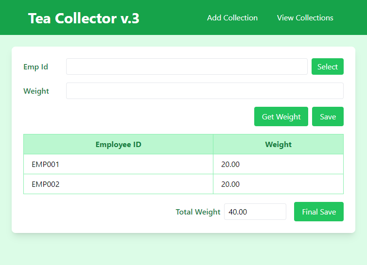
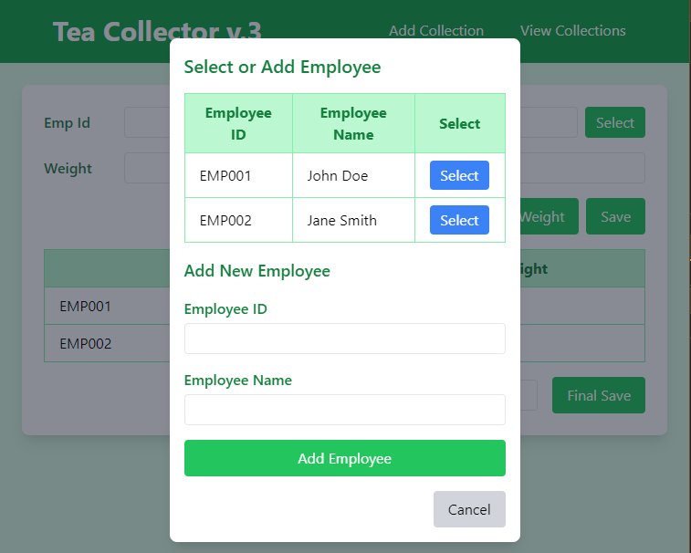
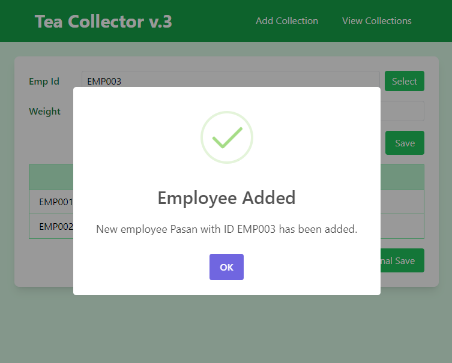
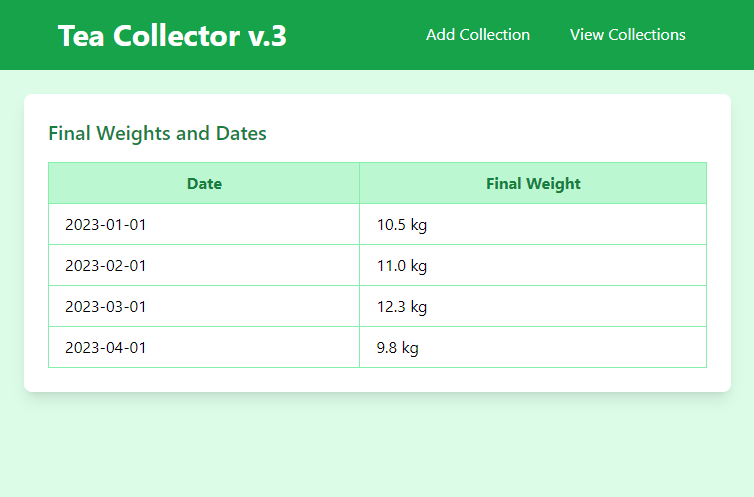

# **Wireframes**
## Wireframe 1: Add Collection Page**
This page allows the supervisor to:
- Enter the **employee ID**.
- View the **current weight**.
- **Select** or **add a new employee**.
- Save the weight data.

**Layout Details**:
1. **Header**:
   - Title: “Tea Collector v.3”
   - Navigation Links: “Add Collection” and “View Collections”
   - Mobile Menu (Hamburger icon for small screens)
   
   
2. **Main Content**:
   - **Employee ID Field**: An input field labeled “Emp ID” with a **Select button** to choose or add an employee from a modal.
   - **Weight Display**: An input field labeled “Weight” that displays the latest measured weight.
   - **Action Buttons**:
     - "Get Weight" button to fetch the latest measured weight from the scale.
     - "Save" button to store the weight data.
   
3. **Employee-Weight Table**: Displays the current entries (employee ID and weight) in a table, dynamically updated with each entry.

4. **Total Weight Section**: Displays the cumulative weight of all entries.

5. **Final Save Button**: Saves the final weights.

**Add Collection Page**: 

**Add Employee Model**: 

**Notification**: 

#### **Wireframe 2: Final Weights Table Page**
This page displays the final weight entries, including the date and the total weight, with data fetched from the server.

**Layout Details**:
1. **Header**:
   - Title: “Tea Collector v.3”
   - Navigation Links: “Add Collection” and “View Collections”

2. **Main Content**:
   - **Final Weights Table**:
     - A table with two columns: 
       - Date (when the data was saved)
       - Final Weight
     - Dynamically populated from the database.
   - **Scrollable Table**: Supports an overflow feature for handling many records.

3. **Buttons**:
   - Navigation links to other pages (e.g., back to Add Collection page).

**View Collections Page**: 

### Explanation of Wireframes

1. **Responsive Design**:
   - The layout should be responsive, adjusting based on the device's screen size. This is facilitated using **Tailwind CSS**.
   - For mobile users, the navigation should collapse into a hamburger menu, while on larger screens, the full menu should be visible.

2. **Modal Design** (for adding/selecting employees):
   - Modal pops up when the user clicks the **Select** button on the "Add Collection" page.
   - Inside the modal, employees can be selected from a table, or new employee data can be entered and saved.
   - After selecting or adding an employee, the modal should close, and the employee ID should be populated in the form.
